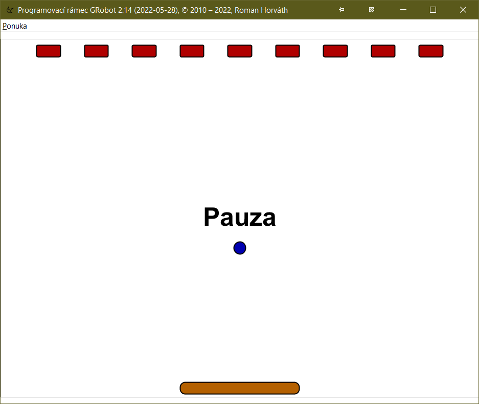

# Stena (The Wall)

*Slovenský text nájdete nižšie (for Slovak scroll down).*

A mini-project created as part of programming lessons in the summer semester of 2022. It is a sample of the classic game Stena (The Wall). The project is based on the [GRobot](https://github.com/raubirius/GRobot) framework.

## Slovenský text (Slovak description)…

Miniprojekt vytvorený v rámci hodín programovania v letnom semestri roku 2022. Ide o ukážku klasickej hry Stena. Projekt je postavený na báze frameworku [GRobot](https://github.com/raubirius/GRobot).
